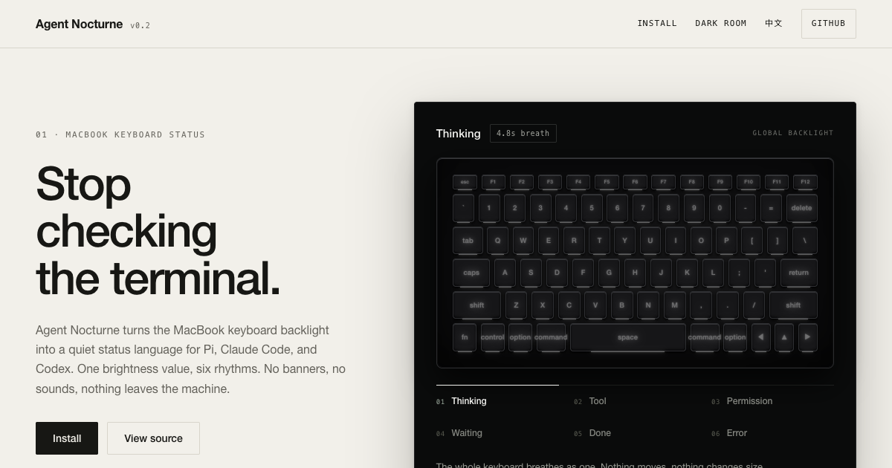

<div align="center">



# Agent Nocturne

**A nocturne for your coding agent — played on the MacBook keyboard backlight.**

[Website](https://taekchef.github.io/agent-nocturne/) · [中文说明](README.zh-CN.md) · [Install](https://taekchef.github.io/agent-nocturne/#install)

[](LICENSE)
[](https://nodejs.org)
[](https://www.apple.com/macos)
[](CONTRIBUTING.md)

</div>

---

> A nocturne is a quiet composition for the night. Agent Nocturne turns your MacBook keyboard backlight into the same kind of calm signal — so a coding agent can tell you where it is without pulling your eyes off the work.

Agent Nocturne turns the built-in MacBook keyboard backlight into a **local status language** for [Pi](https://github.com/earendil-works/pi-coding-agent), Claude Code, and Codex.

It uses **cadence, not color**, to distinguish thought, tool activity, requests for attention, completion, and failure. A MacBook keyboard exposes one global brightness value, so Agent Nocturne does not claim RGB or per-key effects — it turns *timing* into meaning.

## TL;DR

- 🎵 **Cadence over color** — six rhythms (breath, pulse, blink, taps, exhale, stutter) carry the state, not hue.
- 🔒 **Fully local** — events travel a user-only Unix socket (`0600`). No account, no cloud, no analytics, nothing leaves the machine.
- 🛟 **Fail-open** — if the daemon or an adapter is unavailable, the coding agent runs normally.
- 🔌 **Three adapters** — Pi, Claude Code, and Codex, observed through their lifecycle hooks.

## Quick start

Install the core (macOS, Node.js ≥ 20, Xcode Command Line Tools):

```bash
git clone https://github.com/taekchef/agent-nocturne.git
cd agent-nocturne
npm run build:native
npm link
nocturne config init
nocturne daemon start
nocturne status
```

Then add one adapter (e.g. Claude Code):

```bash
claude plugin marketplace add taekchef/agent-nocturne
claude plugin install agent-nocturne@agent-nocturne
```

Test the hardware, then restore the captured brightness:

```bash
nocturne test thinking --duration 3
nocturne test done --duration 1
nocturne restore
```

Full adapter instructions are in [Install](https://taekchef.github.io/agent-nocturne/#install) and [docs/install.md](docs/install.md).

## Why "Nocturne"?

A *nocturne* is a night piece — quiet, restrained, made for the dark hours. When you code at night with an agent running, you don't want banners, sounds, or a terminal you have to keep checking. You want a signal that sits at the edge of your attention.

So the keyboard plays a small nocturne: a slow breath while the agent thinks, a soft exhale when it's done, a sharp stutter only when something truly fails. The room stays quiet. You keep working.

## Support status

| Integration | Status |
|---|---|
| Pi | Verified with mock and native backends |
| Claude Code | Official plugin; strict validation and live hook execution verified |
| Codex CLI | Verified on 0.145.0 with normal and tool turns |
| Codex Desktop | Verified through the bundled 0.146 app-server used by ChatGPT Desktop |

Adapters are fail-open. If Agent Nocturne or its daemon is unavailable, the coding agent continues normally.

## Nocturne lighting language

| State / event | Default effect |
|---|---|
| `thinking` | slow asymmetric 4.8 s breath |
| `tool-start` / `tool` | one batch acknowledgement, then a dim active pulse |
| `tool-error` | one muted dip for a recoverable tool failure |
| `permission` | urgent high-contrast blink |
| `waiting-input` | two reminder taps |
| `blocked` | long-pause heartbeat |
| `compact` | very slow low breath |
| `background` | dim heartbeat |
| `done` | one soft completion exhale |
| `error` | sharp stutter for a terminal failure |
| `cancelled` | fade-down pulse |
| `idle` | restore the latest user brightness baseline |

Parallel tools form one batch, so routine reads and shell calls do not repeatedly flash the keyboard. Recoverable tool failures remain distinct from terminal agent failures.

## Requirements

- macOS on a MacBook with a built-in backlit keyboard
- Node.js 20 or newer
- Xcode Command Line Tools (`clang`) for the native backend

> [!WARNING]
> The native helper dynamically uses Apple's private `CoreBrightness.framework`. It requires no kernel extension or elevated privileges, but Apple may change or remove this API in a future macOS release. Use `nocturne restore` to recover the captured brightness and the mock backend when native control is unavailable.

## Install the core

```bash
git clone https://github.com/taekchef/agent-nocturne.git
cd agent-nocturne
npm run build:native
npm link
nocturne config init
nocturne daemon start
nocturne status
```

The legacy `agent-light` command remains an alias. Existing configuration, logs, socket names, and the `AgentLight` application-support directory are intentionally retained for compatibility.

Test the hardware and restore the original brightness:

```bash
nocturne test thinking --duration 3
nocturne test done --duration 1
nocturne restore
```

Use the mock backend while developing:

```bash
NOCTURNE_BACKEND=mock nocturne test thinking --duration 2
NOCTURNE_BACKEND=mock nocturne status
```

## Pi

From the cloned repository:

```bash
mkdir -p ~/.pi/agent/extensions
ln -sf "$PWD/adapters/pi/agent-light.ts" ~/.pi/agent/extensions/agent-nocturne.ts
```

Run `/reload` in Pi or restart Pi. Disable it temporarily with `NOCTURNE_DISABLE_PI=1 pi`.

## Claude Code

Install the core first, then the official plugin:

```bash
claude plugin marketplace add taekchef/agent-nocturne
claude plugin install agent-nocturne@agent-nocturne
```

The plugin observes lifecycle hooks only. It does not add prompt context or make permission decisions.

## Codex CLI and Desktop

Install the core first, then the official plugin:

```bash
codex plugin marketplace add taekchef/agent-nocturne --ref main
codex plugin add agent-nocturne@agent-nocturne
```

Open `/hooks` in Codex and review/trust the Agent Nocturne hook definitions. Codex hashes non-managed hooks; changed hooks require review again. Start a new CLI session or Desktop conversation after enabling the plugin.

Codex fires `PostToolUse` after non-zero Bash exits, but Codex CLI 0.145.0 and the tested Desktop 0.146 app-server send an empty `tool_response` for that event. Agent Nocturne cannot reliably distinguish those recoverable failures from successful tools until Codex supplies structured outcome data. Codex also has no hook equivalent to Claude Code's terminal `StopFailure`; no failure parity is claimed.

## Commands

```bash
nocturne notify thinking --agent pi --session abc
nocturne notify tool-start --agent pi --tool Bash
nocturne notify tool-error tool-end --agent pi --tool Bash
nocturne notify permission --agent codex
nocturne notify done --agent claude
nocturne notify error --agent pi --terminal
nocturne notify idle --agent pi

nocturne status
nocturne test thinking --duration 5
nocturne restore
nocturne pause
nocturne resume
nocturne daemon start
nocturne daemon stop
nocturne config show
```

### Pause and resume

Run `nocturne pause` to silence the keyboard at once — the backlight returns to your brightness and stays there. The paused state is persisted, so it survives a daemon restart (including the auto-start triggered by agent hooks). Run `nocturne resume` to turn the signal back on.

## Configuration

Compatibility path:

```text
~/Library/Application Support/AgentLight/config.json
```

The default Nocturne profile is equivalent to:

```json
{
  "backend": "auto",
  "maxBrightness": 0.8,
  "minBrightness": 0.05,
  "respectKeyboardOff": false,
  "effects": {
    "thinking": { "periodMs": 4800 },
    "permission": { "periodMs": 540, "reminderPeriodMs": 2000 },
    "tool": { "periodMs": 1800 },
    "done": { "pulses": 1 },
    "error": { "pulses": 4 }
  }
}
```

Restart the daemon after changing configuration. If the captured baseline is `0`, animations temporarily light the keyboard by default and restore it to `0` on idle. Set `respectKeyboardOff` to `true` to keep it dark.

## Architecture

```text
Pi / Claude Code / Codex adapter
              │ local normalized event
              ▼
        nocturne CLI
              │ Unix socket (mode 0600)
              ▼
     Agent Nocturne daemon
              │ serialized brightness writes
              ▼
  CoreBrightness helper or mock backend
```

The daemon tracks state per agent session, prioritizes concurrent agents, expires stale states, and refreshes the user's brightness baseline while idle. Active animation ticks run at 80 ms; idle polling drops to 1.5 s.

## Privacy and safety

- Runtime processing is local; Agent Nocturne makes no network requests.
- Logs may contain working-directory paths, agent names, tool names, and opaque session IDs.
- Compatibility log path: `~/Library/Logs/AgentLight/agent-light.log`.
- Logs are never uploaded by the project.
- The Unix socket is user-only (`0600`).
- Hooks emit no model-visible stdout and never approve or deny tools.
- `nocturne restore` restores the captured baseline brightness.

## FAQ

**Does it keep the backlight on all the time?**
No. On `idle`, the daemon restores your latest manual brightness baseline — including `0` (off). Set `respectKeyboardOff: true` to keep it dark even during animation.

**How do I turn it off when it gets distracting?**
`nocturne pause`. The keyboard goes quiet immediately and stays quiet — even when an agent fires a hook that would normally spin the daemon back up. `nocturne resume` turns it back on.

**Will it fight me when I change brightness manually?**
No. While idle, the daemon refreshes the baseline every 1.5 s, so your manual adjustment becomes the new resting level. `nocturne restore` always returns to it.

**Does it work with an external keyboard?**
No. It drives the built-in MacBook keyboard backlight via the private `CoreBrightness` API, which has no concept of external devices.

**Is there a Windows / Linux version?**
No. The hardware control path is macOS-specific. The mock backend exists for development and CI on any OS.

## Development

```bash
npm run check
npm test
npm run validate:claude
npm run build:native
NOCTURNE_BACKEND=mock npm run smoke:mock
```

See [installation notes](docs/install.md) and [troubleshooting](docs/troubleshooting.md).

## License

[MIT](LICENSE) · Built by [@taekchef](https://github.com/taekchef)

中文说明见 [README.zh-CN.md](README.zh-CN.md).
